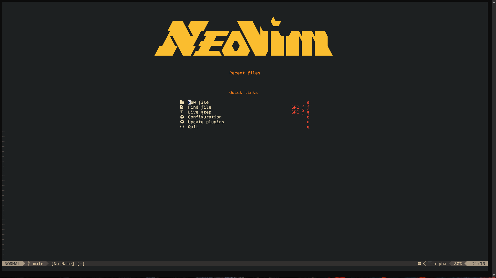
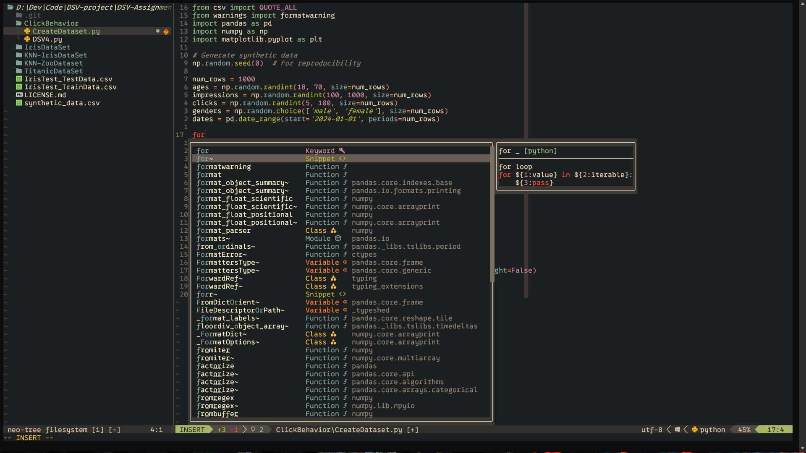

# Neovim Configuration

Welcome to my Neovim configuration repository! This repository contains my personal Neovim setup, including a variety of plugins and configurations to enhance the Neovim experience. Below you will find an overview of the included plugins and how to get started with this configuration.

## Table of Contents

- [Installation](#installation)
- [Plugins](#plugins)
- [Configuration](#configuration)
- [Keybindings](#keybindings)
- [Screenshots](#screenshots)
- [Contributing](#contributing)
- [License](#license)

## Installation

To use this configuration, follow these steps:

1. **Clone the repository**:
    ```sh
    git clone https://github.com/navaneet-rao/neovim-config.git ~/.config/nvim
    ```

2. **Install Neovim (if not already installed)**:
    Follow the instructions on the [Neovim GitHub repository](https://github.com/neovim/neovim) to install the latest version of Neovim.

3. **Install required dependencies**:
    Ensure you have the necessary dependencies installed. You can use a package manager like `apt`, `brew`, or `yum` to install them.

4. **Install Plugins**:
    Once Reload the neovim and Lazy will install the required plugins.
    ```sh
    nvim
    ```

## Plugins

This configuration includes the following plugins:

- **[nvim-treesitter](https://github.com/nvim-treesitter/nvim-treesitter)**: Advanced code highlighting and parsing.
- **[neo-tree.nvim](https://github.com/nvim-neo-tree/neo-tree.nvim)**: A file explorer tree for Neovim.
- **[gruvbox.nvim](https://github.com/ellisonleao/gruvbox.nvim)**: A retro groove color scheme.
- **[telescope.nvim](https://github.com/nvim-telescope/telescope.nvim)**: Highly extendable fuzzy finder over lists.
- **[nvim-web-devicons](https://github.com/nvim-tree/nvim-web-devicons)**: File type icons for Neovim plugins.
- **[lualine.nvim](https://github.com/nvim-lualine/lualine.nvim/blob/master/THEMES.md)**: A blazing fast and easy to configure statusline.
- **[mason.nvim](https://github.com/williamboman/mason.nvim)**: Portable package manager.
- **[mason-lspconfig.nvim](https://github.com/williamboman/mason-lspconfig.nvim)**: Bridges mason.nvim with lspconfig.
- **[nvim-lspconfig](https://github.com/neovim/nvim-lspconfig)**: Quickstart configurations for the Neovim LSP client.
- **[telescope-ui-select.nvim](https://github.com/nvim-telescope/telescope-ui-select.nvim)**: Telescope UI for `vim.ui.select`.
- **[lazygit.nvim](https://github.com/kdheepak/lazygit.nvim)**: Plugin to integrate LazyGit with Neovim.
- **[trouble.nvim](https://github.com/folke/trouble.nvim)**: A pretty list for showing diagnostics, references, and more.
- **[alpha-nvim](https://github.com/goolord/alpha-nvim)**: A fast and highly customizable greeter.
- **[none-ls.nvim](https://github.com/nvimtools/none-ls.nvim)**: Use Neovim as a language server to inject LSP diagnostics, code actions, and more.
- **[nvim-cmp](https://github.com/hrsh7th/nvim-cmp)**: A completion plugin for Neovim.
- **[LuaSnip](https://github.com/L3MON4D3/LuaSnip)**: Snippets plugin for Neovim.
- **[cmp-nvim-lsp](https://github.com/hrsh7th/cmp-nvim-lsp)**: LSP source for nvim-cmp.
- **[harpoon](https://github.com/ThePrimeagen/harpoon/tree/harpoon2)**: Quick file navigation.

## Configuration

The configuration for each plugin can be found in the respective files within the `lua/` directory. For example, the configuration for `nvim-treesitter` can be found in `lua/plugins/treesitter.lua`.

Feel free to explore and customize these configurations to fit your needs.

## Keybindings

Keybindings are defined in the `init.vim` or `init.lua` file. Here are some of the keybindings used in this configuration:

- **File Explorer**: `Ctrl + b` to toggle Neo-tree.
- **Fuzzy Finder**: `Ctrl + ff` to open Telescope.
- **LSP**: `gd` to go to definition, `gr` to show references.
- **Git**: `Leader + gg` to open LazyGit.

#### Using `<leader>/` to Fuzzy Find Keybinds

1. **Open Neovim.**
2. **Press `<leader>/` to open the fuzzy finder.**
3. **Type `: Telescope keymaps` to search for the key bindings.**

#### Referring to `keymaps.lua` for Configuring Keybinds

1. **Locate your Neovim configuration directory.** <br>
   Typically, this is `~/.config/nvim/` on Unix-based systems or `~/AppData/Local/nvim/` on Windows.
4. **Open the `keymaps.lua` file in your preferred editor.** For example, run `nvim ~/.config/nvim/lua/../../keymaps.lua`.
5. **Edit or review the key bindings as needed.**


## Screenshots

Here are some screenshots of the setup:




## Contributing

Contributions are welcome! Please open an issue or submit a pull request with any improvements or bug fixes.

## License

This project is licensed under the License. See the [LICENSE](./LICENSE.md) file for details.

---

Enjoy coding with Neovim! If you have any questions or suggestions, feel free to open an issue.
